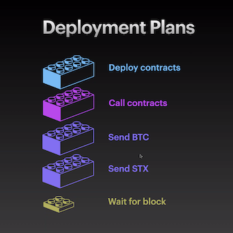

# Clarinet Deployment Plans demonstration

Clarinet is the CLI workflow for developing and publishing smart contracts to Stacks, the Bitcoin smart contract L2. Clarinet has a powerful feature: deployment plans—reproducible deployment steps that publish a collection of on-chain transactions and one or more contracts to a network. 



This repository hosts the code for the two Clarinet projects used to demonstrate deployment plans, their use in development, testing, automation, and deployment. 

## Links & Resources

- Watch the YouTube video demonstration!
- Deployment plans technical documentation
- Stay up to date with [Hiro—developer tooling for Web3 on Bitcoin](https://www.hiro.so/updates)
- [Join the Stacks Discord](https://discord.gg/5DJaBrf) and grab the "developer" role for support

## CLI Commands & Code used in video demonstration

Step 0: `brew install clarinet` or `winget install clarinet`

### Create a new Clarinet project
- `clarinet new <project>`
- `cd <project>`
- `clarinet contract new <contract>`

### *Metaverse* Project

```

                ┌────────┐
                │  STX   │
                │  user  │
         ┌──────┴────────┘
         │
         │
        [1]
         │
         │
┌────────▼──────┐     ┌───────────────┐
│               │     │               │
│  nft-factory  │     │   ft-factory  │
│               │     │               │
│               ├─[2]─►               │
│               │     │               │
│               │     │               │
└───────────────┘     └───────────────┘

[1] User claims an NFT
[2] Only with NFT can user can mint FT
```

1. Create the two relevant NFT and FT contracts
    - `clarinet contract new nft-factory; clarinet contract new ft-factory`
2. 🎵 *Contract contents developed*  🎵 
    - see [contracts](/contracts) section of repo
3. Add token SIP trait references ([SIP-009 NFT standard](https://github.com/stacksgov/sips/blob/main/sips/sip-009/sip-009-nft-standard.md) and [SIP-010 FT standard](https://github.com/stacksgov/sips/blob/main/sips/sip-010/sip-010-fungible-token-standard.md)) that are implemented in project (instead of redeploying these contracts alongside your project, a redundant and costly practice that is deprecated)
    - `clarinet requirements add SP2PABAF9FTAJYNFZH93XENAJ8FVY99RRM50D2JG9.nft-trait`
    - `clarinet requirements add SP3FBR2AGK5H9QBDH3EEN6DF8EK8JY7RX8QJ5SVTE.sip-010-trait-ft-standard`

### Deployment plans
1. Generate the default deployment plan, a function of your `Clarinet.toml` manifest and `<network>.toml` settings files, i.e.
    - `clarinet deployments generate --simnet`
    - `clarinet deployments generate --devnet`
2. Manually add `claim` contract call transaction (and any other desired contract actions) to deployment plan so that contract deployer mints and claims an NFT 
```yaml
    - id: 1
      transactions:
        - contract-call:
            contract-id: ST1PQHQKV0RJXZFY1DGX8MNSNYVE3VGZJSRTPGZGM.nft-factory
            expected-sender: ST1SJ3DTE5DN7X54YDH5D64R3BCB6A2AG2ZQ8YPD5
            method: claim
            parameters: [] 
            cost: 5960
```
3. Deploy to local simnet (`clarinet console`, etc.) or local devnet (`clarinet integrate`) for testing or integration
    - **For all default deployment plans that are customized**, i.e. a transaction is manually edited or added: user will be prompted to overwrite their customized plan with the default plan. To proceed with your custom deployment plan, type `no`
4. Deploy to testnet for testing. First generate default deployment plan, and then make same changes (adding the contract call transaction)
    - `clarinet deployments generate --testnet`
5. Add private key mnemonic to `Testnet.toml`
    - DO NOT SHARE OR UPLOAD PRIVATE KEYS
6. Procure testnet STX from faucet
    - [testnet faucet here](https://explorer.stacks.co/sandbox/faucet?chain=testnet) or claim via the [API here](https://docs.hiro.so/api#tag/Faucets/operation/run_faucet_stx)
7. Deploy contract to testnet by specifying path or network
    - `clarinet deployment apply --testnet`

#### Deploy to mainnet
1. Create default deployment plan, specify cost strategy to more or less incentivize miners to carry your transactions
    - `clarinet deployments generate --mainnet --medium-cost`
2. Add private key mnemonic to `Mainnet.toml`
    - DO NOT SHARE OR UPLOAD PRIVATE KEYS
3. Ensure your wallet has STX. See [Hiro Wallet extension](https://wallet.hiro.so/) and built-in fiat<>crypto onramp
4. Deploy contract to testnet by specifying path or network
    - `clarinet deployment apply --mainnet`

**See transactions in Explorer**
- [SP2Y2FP02VFZN0XGYTT1ZT3Y8EWTSEWCVASGES70T.ft-factory](https://explorer.stacks.co/txid/0x5c9cec6d28627bd73db277297d1a239f758fca087c9e3259b721686abd4801b3?chain=mainnet)
- [SP2Y2FP02VFZN0XGYTT1ZT3Y8EWTSEWCVASGES70T.nft-factory](https://explorer.stacks.co/txid/0x2a84525f24fb6c2e8764f487b12d20c5c45a7eb44650ccbbc6c1b25cd674c59a?chain=mainnet)
- Manually specified `claim` contract call in deployment plan: txid [0x09d67be58578c68dac709b3bd618ab11c12d882c15b9669b422fec1656ff2d81](https://explorer.stacks.co/txid/0x09d67be58578c68dac709b3bd618ab11c12d882c15b9669b422fec1656ff2d81?chain=mainnet)
